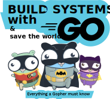

# What is this?

This is a repository containing all the examples from the book **BUILD SYSTEMS
with GO (and save the world)**. This book is written to help GO early
and not-so-early developers with all the necessary examples to
build real systems. The book is organized into two different parts.
The first part, explains the language from the basics to more 
advanced topics using the standard library. The second part, offers
the developer a condensed summary of several tools any real system
is made of: gRPC, SQL and NoSQL databases, streaming with Kafka, 
loggers, CLIs (Command Line Interfaces), restful APIs, etc.

The examples are made available at this repository for everybody
under the Apache License. Feel free to fork this repo or to take
a look to any specific topic you may find relevant. The examples are 
not explained in the code basically because all the explanations are
given in the book. If you are interested in the book you can purchase
it at [Amazon](XXXXXXXXXXX).

# Organization

The repository is organized following the book structure. Every
folder corresponds to a chapter, and subfolders correspond to the 
sections of the chapter. The examples are easy to find following
the book.

Most of the code examples are self-contained and can be directly
executed with `go run main.go`. 

If additional steps are required to
run any example, these are given in the corresponding folder and 
explained in the book.

# Acknowledgements

The amazing "Gotham Gophers" image was created by Egon Elbre 
([@egonelbre](https://www.twitter.com/egonelbre)) under 
Creative Commons. Check out his [repository](https://github.com/egonelbre/gophers)
for more high quality illustrations.

# Issues
If you have found any code issue please report it using GitHub.

# License
This work is released under the Apache License.
